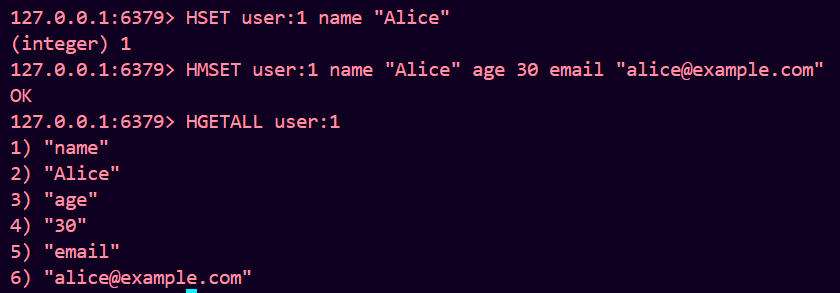
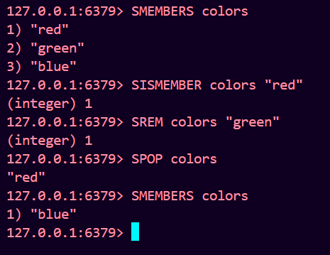

# Redis CRUD Operations

## Strings
### Create/Update
Set a string value to a key:
```sh
SET username "JohnDoe"
```
Set a value with an expiration time (in seconds):
```sh
SETEX session_key 3600 "session_data"
```
### Read
Get the value of a key:
```sh
GET username
```
Get multiple values using multiple keys:
```sh
MGET key1 key2 key3
```
### Delete
Delete a key and its value:
```sh
DEL username
```


## Hashes
### Create/Update
Set a field value in a hash:
```sh
HSET user:1 name "Alice"
```
Set multiple field values in a hash:
```sh
HMSET user:1 name "Alice" age 30 email "alice@example.com"
```
### Read
Get the value of a field in a hash:
```sh
HGET user:1 name
```
Get multiple field values in a hash:
```sh
HMGET user:1 name age email
```
Get all the fields and values in a hash:
```sh
HGETALL user:1
```


### Delete
Delete a field from a hash:
```sh
HDEL user:1 email
```


## Lists
### Create/Update
Add elements to the head (left) of a list:
```sh
LPUSH fruits "apple" "banana"
```
Add elements to the tail (right) of a list:
```sh
RPUSH fruits "cherry" "date"
```
### Read
Get elements from a list by index range:
```sh
LRANGE fruits 0 -1
```
Get an element from a list by index:
```sh
LINDEX fruits 2
```

### Delete
Remove elements from the head (left) of a list:
```sh
LPOP fruits
```
Remove elements from the tail (right) of a list:
```sh
RPOP fruits
```
Remove an element from a list by its value:
```sh
LREM fruits 1 "banana"
```


## Sets
### Create/Update
Add elements to a set:
```sh
SADD colors "red" "green" "blue"
```
### Read
Get all elements in a set:
```sh
SMEMBERS colors
```
Check if an element is a member of a set:
```sh
SISMEMBER colors "red"
```
### Delete
Remove elements from a set:
```sh
SREM colors "green"
```
Remove and return a random element from a set:
```sh
SPOP colors
```


## Sorted Sets
### Create/Update
Add elements with scores to a sorted set:
```sh
ZADD scores 10 "player1" 20 "player2" 30 "player3"
```
Update an element's score in a sorted set:
```sh
ZINCRBY scores 5 "player1"
```
### Read
Get elements from a sorted set by index range:
```sh
ZRANGE scores 0 -1
```
Get elements from a sorted set by score range:
```sh
ZRANGEBYSCORE scores 10 20
```
### Delete
Remove elements from a sorted set:
```sh
ZREM scores "player1"
```
Remove elements from a sorted set by index range:
```sh
ZREMRANGEBYRANK scores 0 1
```
Remove elements from a sorted set by score range:
```sh
ZREMRANGEBYSCORE scores 10 20
```

